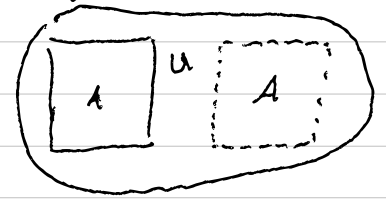
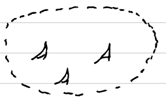
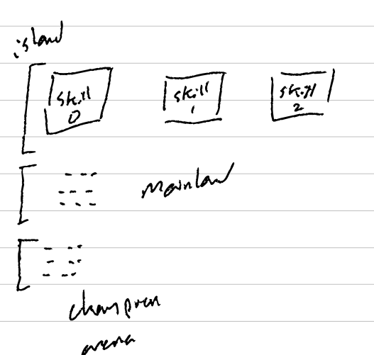
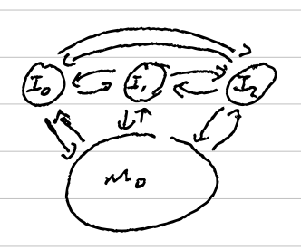

Leader Follower
=====

# License

See the [LICENSE file](LICENSE) for license rights and limitations (MIT).

# Index

- [Roadmap](#roadmap)
- [Multiagent Reliance-Based Learning State](#multiagent-reliance-based-learning)
  - [Introduction](#introduction)
  - [Background](#background)
  - [Approach](#approach)
  - [Results](#results)
  - [Conclusion](#conclusion)
  - [Future Work](#future-work)
- [Environments](#environments)
  - [HarvestEnv](#harvestenv)
- [Agents](#agents)
  - [Harvester](#harvester)
  - [Excavator](#excavator)
  - [Obstacle](#obstacle)
  - [PoI](#poi)
- [Rewards](#rewards)
- [CCEA](#ccea)
  - [Mutation](#mutation)
  - [Selection](#selection)

# Roadmap

 

 

 

## Todo

- [ ] Write draft of introduction
  - Expected: 8/7/23
  - Actual:
  - Go over notes, emails, and conversations to figure out all tests and story to convey
- [ ] Write draft of background
  - Expected: 8/14/23
  - Actual:
  - Pull from fitness shaping section in quals
- [ ] Write draft of approach
  - Expected: 8/8/23
  - Actual:
- [ ] Write draft of results
  - Expected: 8/10/23
  - Actual:
- [ ] Write draft of conclusion
  - Expected: 8/11/23
  - Actual:
- [ ] Write draft of future work
  - Expected: 8/11/23
  - Actual:
- [x] Script to restart a stat run
- [x] Multiprocessing subpop simulations in each generation
- [x] Combine multiple stat runs into the same plot
- [x] Animation to watch rollout of episode
  - Include circles around POIs to indicate observation radius.
- [ ] Documentation
  - Agent types
  - Environment dynamics
  - Reward structure
  - CCEA optimization
  - Island setup
  - Island migrations
- [ ] Add reward option to be based on average distance of n closest observing agents
- [x] Add agent weight parameter that affects how much an agent affects the environment (satisfy coupling for harvesters and excavators, coupling requirement for obstacles and pois)
- [x] Add agent value parameter that affects how much an agent can contribute to the environment (rewards from pois and harvesters)
- [ ] Implement mfl as a comparison baseline

# Multiagent Reliance-Based Learning

## Introduction

[//]: # (Focus on relevance to the field/contribution)
[//]: # (Frame reliance as a tradeoff of individualized skills and all learning simultaneously)
[//]: # (Mfl using own behaviors versus relying on others)
[//]: # (Tell other agents how to act or what to do)
[//]: # (Shared policies all learn the same thing)
[//]: # (QD process running on each island with CCEA running on mainland)
[//]: # (Islands produces sets of initializations for the optimization process running on the mainland)
[//]: # (EA's prone to local minima based on starting conditions)
[//]: # (Mfl/options and traditional ccea loop on opposite ends of a spectrum)
[//]: # (one end optimizes skills and then learns using those skills)
[//]: # (other end goes in with no learned skills and learns to cooperate while learning skills)
[//]: # (flexible options are somewhere in the middle)
[//]: # (but are hindered by a very large joint actions space, as we move towards multiagent systems)

### Questions

1. What is the problem, why do I care?
2. Why is it important or difficult?
3. What has been done in this area?
4. What particular problem remains unsolved?
5. How did you solve it?
6. What's cool about your approach?
7. What were your key results?
8. What is the key contribution of this paper?

In this work, we present a peer-to-peer network architecture for large-scale distributed learning in complex multiagent settings that require joint coordination between asymmetric agents.

## First week

This past week, I mainly focused on two things. The upcoming quals re-do and the effort with Gaurav on training skills that benefit when training under the expectation that an agent will have other agents supporting their efforts.

For the first, the quals oral re-do, Anna has been my touch point for making sure the story flows at a high level, and I am working on replacing the text/words with more easier to digest graphics. This starts at the first slide with a generic rover example where I add a minimal change (longer time horizon and less potential for user feedback) and carry that through the presentation. Currently, I am working on making sure the graphics, in particular, fit for the survey questions to make sure they fit the stage nicely for the proposed research directions.

For the effort with Gaurav, I spent the past few days setting up the repos on my desktops and making sure I can replicate his experiments with the asymmetric island model. Once that was setup, I went through his code base and made comments/todos in the code with where changes could be made to incorporate the island-island migrations, and how we might enforce islands only evolving one type of agent while the other types of agents remain static. For this first effort, I am assuming that each type of agent is the only type of agent that is meant to fulfil a role (in contrast to the possibility that different roles may be fulfilled by different types of agents with different capabilities/training objectives). I.e. There is a one-to-one mapping between agent type and agent role.

For the coming week, I am planning on nailing down the wording and delivery of the presentation, so I plan on doing two full practice runs each day. After each, I mark points that falter and explicitly fix those up before the next run through. The full run through helps make sure it remains cohesive while the in-between changes actually progress the story points.

I am also working through some material Gaurav pointed me towards (mainly POET from Uber and Melting pot from deepmind) about design principles for the environment design. The idea being for different approaches we may take for altering the rover domain problem to exhibit the traits we want to explore.

## Second week

Since we last spoke, I set up several boards to help with tracking goals and tasks in smaller chunks (i.e. kanban-style board). Additionally, I thought more about how roles manifest themselves in the types of problems Gaurav and I are looking at and designed a basic scenario that should allow us to make sure the islands are operating as expected in the presence of both learners and non-learners. I also planned out several ideas about how we might design more pointed tests to evaluate the effectiveness of this approach without requiring the training on the mainland to improve in a meaningful capacity (e.g. evaluation method that looks at a single island to see if this paradigm makes any meaningful difference).

For the coming week, the plan is to proceed on the two works we discussed on Friday, the effort with Gaurav and the survey paper on fitness modeling.

For the first effort with Gaurav, I plan on adding in the framework for the island migrations, using a similar approach as he already does for the island-mainland migrations. This also includes the structure for allowing for different migratory schedules (particularly to allow for a minimal criterion before a learned policy is migrated to the other sub-islands and made static on those sub-islands where it is not expected to learn). This also means that we need to make sure we have a way of distinguishing between a learning population and non-learning policy that are operating in a shared environment and can identify a policy when it needs to be updated from a previous migration.

For the fitness modeling paper, going back to basics, I plan on diagramming out the different ways in which this is done in the current literature from the past 3 years (at gecco and amas), with particular attention as to how they relate to each other. This means several paragraphs as to the core approach for each method and, namely, how they differ from the other approaches.

As for the decision to continue in the current capacity, I think you are right. At this point, I question if this is even of interest to me. The why is something that could be from a myriad of things, but ultimately, I think banging my head against it would prove fruitless. We can (and should) discuss it further along with next steps.at our meeting at 9 tomorrow. I'll make sure to bring my class completion and what it looks like I have remaining.

I think I needed a bit of a push, and I appreciate you giving that to me.

## Third week

My goals for the previous week were to add in migrations between islands (and to the mainland) and the mechanism for the migration schedule. For the survey paper, it was to create the initial characterization based on the summaries from papers from the past three years.

I was able to add in the migrations and frameworks for scheduling (using a functional approach),  as well as outline experiments, implementation details for the environment, and an initial implementation for the migration schedule. But for the survey paper, the grounding that separates the approaches is fuzzy. Instead, it's broken into several categories that have a different feel, but I have yet to clearly delineate what that flavor is.

For the coming week, I intend to focus more on the island project more than the fitness survey and let the survey paper sit a bit while I ruminate on what clearly distinguishes the approaches. I hope to create a nice (or initial) graphic in the following week for this. And for the island project, I intend to have a minimal working example that can output an initial set of results. This will lead into how to characterize the results, but this minimal working example will let us visualize the learned policies so we can begin to dig into are they working? If so, how so? If not, why not?

### Fourth week

The goal for the previous week was to get the code to the point that it was able to run initial experiments. As for the fitness survey, it was to start to design a graphic for characterizing approaches.

As far as progress, I focused more heavily on the island model design as I identified a few considerations I had not considered fully, namely around how the qd process Quarav was running on his islands might play into how to migrate between islands. I was able to get the env done and the dynamics all tied together.

Guarav and I spoke about the QD processes more mid-week and decided that this could be an extension/future work as this effort is meant to focus on island-island migrations. Additionally, I designed a part of a presentation that is meant to capture the idea we are working towards. This focuses on extending the lifting a table example with the addition that we nail the table to the ground. The point here is that the capabilities of a single agent cannot complete the task. Instead, it has to rely on a different (type of) agent to do the same behavior before it can complete the task.

For this coming week, I want to make those visualizations of the learning and environment. Currently, I am using gdp/pdb exclusively to debug everything. We'll need these visualizations anyways for the paper, so I'd like them as dual purpose to make sure everything is as I expect it and makes it easier to present/talk about.

As initial results, the env is setup to basically not allow one type of agent to complete the task. So it's not much of a surprise that adding multiple roles allows for better learning. When not using island-island migrations (what should we call these?), learning *can* happen, but it's much slower if it happens since it can only occur during the more monolithic training on the mainland.

For the coming week, I intend to focus on the story after creating the visualizations so that we can discuss next week how we can sell the story in the paper. For the fitness survey, with the slight break to think about it, I intend to write the intro section that describes the different approaches and what distinguishes them.

### Fifth week

The previous week was meant to be spent on building the graphs and trajectories that would go into the paper, with the hope that they could also help identify any issues in the process or act as a verifier for the current findings. I was able to get some of the desired plots in place, but one in particular stood out. These plots highlight the portions of the state that are changed between generations or that are "most heavily weighted" when the agent decides on an action. The idea here is to gain insight into how the agent(s) are evolving over time from the perspective of what parts of the state-space they are changing to make their decisions. An interesting finding was that it can be really easy for the agents to "fixate" on certain portions of the state. This can impede learning, especially if the support agents lag behind the gathering agents, as the gathering agents effectively learn that the support agents are unreliable, and so default back to behaviors that at least are somewhat beneficial even if the support agents are incompetent. This shows up primarily early on when the initial migration(s) do not occur for an extended period of time (100-200 generations). In this case, the gatherers learn to seek out resources that they can capture without needing to remove obstacles, even if there are better rewards that would require removing obstacles. The obvious fix here would likely be to have the migration schedule decay over time, and initially do migrations much faster (every 15-ish generations). That is my first approach, but I'm also seeing if I can incorporate some level of confidence or UCT type weighting to push the agents away from fixating on portions of the state space, especially early in training.

As I mentioned in the last meeting, I intend to focus on actually writing this week. Namely, I want to have a rough draft of the intro and approach, along with the outline of the portions of the background. The results section would mainly be an outline of the interesting findings so far along with a few initial plots that support those findings. I want to have this to Gaurav by Friday so we can discuss not just the overall story, but also if it could be supported better by certain experiments or configurations.

Part of the reason for the Friday deadline for myself is I anticipate this week to be more full with course work as there is both a quiz tomorrow (that got pushed back from last Thursday) and more impactful, the final and assignment on Thursday. So I think it would be better to just try and minimize the overall time I'm working on that by condensing it to as few days as possible.

### Sixth week

The plan for the previous (two) weeks had been to get the experimental results in a displayable format and to address the consistency issue that sometimes arises early in training where the harvesting agents can seem to fixate on the easier rewards that they are able to accomplish independently, even after migrating obstacle removing policies from the other islands. Unfortunately, my laptop was (is) experiencing an issue with 4 of the logical cores, causing the clock watchdog to timeout, leading to a BSOD. I've been in contact with support, and after trying to troubleshoot the issue, they had me ship it to them since it appears to be a hardware issue. On the upside, I reconfigured another system I use as a headless server to be a daily driver and have been working on updating this system to be at the same place as my laptop. This also requires rewriting some of the code as the cores failing seem to have corrupted some sectors of my ssd. Running some of my recovery utilities didn't recover a lot of things I actually care about, and I hadn't pushed some of the more recent changes. But I do have a version of the code that I had pushed about 4 days before the last meeting (1 am the saturday before), so the time I've effectively lost is those few days and the time spent diagnosing the laptop and setting up the new system. I also lost some of my notes and ideas I had been taking in markdown that I hadn't thought to backup (should just keep those in a private repo). Most of the graphics Gaurav and I have been working on are online or shared in our chats, so the ones lost are the ones generated by the code, which is less of a concern to me.

So the plan for this week is to get everything up to the point that I had wanted it before the system failed. Gaurav and I are planning a meeting in the next day or so to go over what we have. Specifically, what I am working on recreating is the follows:

- Performance plots of each island/mainland
- Live tensorboard of island populations
- State "heatmap" of what the agents are paying attention to when making decisions
- Approach section draft (with all implementation details and gotchas outlined)
- Results section outlined

### Seventh week

The plan for the past week was to get everything up to where it was before the laptop failed. This proved to be a bit ambitious, and I was only able to get the code up to being able to run through the basic example, but none of the plots or automated saving and plotting. The upside, however, is the recreated code seems to be a bit cleaner and slightly faster (subjective). I also was able to retrieve/recreate a lot of the paper notes for the fitness modeling survey, and I set up several safeguards against further loss. The upside here is also that my various systems integrate better, so moving notes between different modalities is less clunky.

For this week, I want to keep chipping away at the list from the previous week. More realistically, after seeing more concretely what remains, I want the first two types of plots along with the approach section draft. Another nice benefit here is in recreating the code, there are a few points that I think are important "gotchas" that I had not considered before. Specifically, the modifications to incorporating a population from another island that may occur while the island is in the middle of a generation. Specifically, the following:

- Performance plots of each island/mainland
- Live tensorboard of island populations
- Approach section draft (with all implementation details and gotchas outlined)

Continuing the string of bad luck, my vehicle's battery seems to have died this past day. I've replaced it and things *should* be fixed, but if there is anywhere it may affect things in the short term, it may be difficult to get to the lab meeting in person tomorrow (if it wasn't the battery, but the power harness or starter). If this proves to be a problem tomorrow, would you be able to open a zoom room?

### Eighth week

I've attached here a copy of a presentation I had created alongside the paper draft (to make it easier to talk through things with Gaurav). When gmail got moved over to outlook, it caused a few issues with syncing across several devices (remarkable to desktop), so I had to deal with that once I landed back in Oregon.

I feel like the slides are in a pretty decent shape for explaining up through the first few paragraphs of the approach section, though it's supported by the talk track. Since my laptop is still out (just got an update yesterday; I should be getting it back July 3rd), if we have time, I'd like to go over it or if you have any comments about the flow from slide to slide.

### Ninth week

This past week, I've been working mainly on the material for Professor Davidson's class with the intent that I can get in a position to complete the rest of the work in the next two weeks. The project I'm working on is on verification for linear controllers where the project is looking into how to determine how well a controller might be expected to work in certain environmental dynamics and how/where might we expect the controller to fail.

As for the research, I've been working on adding in migration of full policies, but that is proving to have a few more complications implementation-wise, primarily with maintaining individual indices so that I can keep almost create a genealogy across time. I want to look into seeing if I can find a way to show that the populations evolve in different "directions" after each migration, and if I can find a "globally" consistent method to determine this. For instance, if we look at two islands, the populations might be evolving in certain directions, but after migrating populations between each other, does this make the populations evolve in a more similar direction? Do they diverge more drastically since they don't have to do all of the same tasks they were doing before and can rely on the other to do some of it instead? But this comparison would only make sense if this metric of measuring "direction" meant a similar thing for each of the islands. If they did not, while we look at how the migrations affected the direction an individual island evolved in (which could be interesting itself), we could not generalize any such statement across islands.

For this next week, I intend to finish implementing full population migrations (and start playing with QD type optimization techniques on this environment). Additionally, I want to find two other environments in literature that might be applicable to this approach, so that we can explore a generalization concept more broadly in the future. With respect to Professor Davidson's class, I intend to have the proposal sometime later tomorrow, once I finish the paragraph on prior approaches. The biggest challenge here is that most of the work I'm finding is applicable towards non-linear controllers.

Alongside those goals for the week, I've realized I've become disorganized with documents, writings, etc, so I want to spend time doing some "spring cleaning", so to speak.

Looking further ahead. within the next two weeks, I'd like to have a rough draft of a masters document. And once I finish the work with Professor Davidson, I'd like to talk with you about that work, as when Guarav and I were speaking last week, I brought up the idea of how a natural extension of this work could be towards a non-linear dynamical system where instead of just evolving the agents, another island is also evolving an "adversarial" environment that is trying to find the failure modes of the agents with the intent of either going towards an auto-curricula approach or a continuous learning domain where there isn't necessarily an "end goal" or "end task". Instead, we are looking towards an open-ended back-and-forth between agent and environment where each tries to beat the other, and eventually, we end up with a fairly generalizable and robust agent that can solve a much broader type task that might be defined in a singular environment or by a single task.

## Background
## Approach
## Results
## Conclusion
## Future Work

[//]: # (introduce the actual task)

[//]: # (Consider a task where multiple agents must simultaneously observe a point of interest &#40;POI&#41; in order to receive any reward from the environment.There are multiple POIs scattered throughout the environment, some further awy than others. If a single POI requires three agents to observe it, then three agents would have to pick actions such that they are within the observation radius of the POI at the same time. The further the POI, the less likely a sequence of random actions from multiple agents, each with a different starting location, will bring them to a similar location. For two or three agents, this is unlikely. As this coupling requirement increases, this random coordination to receive any initial positive feedback becomes next to impossible.)

[//]: # (This work introduce multiagent leader-based learning as a method for addressing this necessity of agents having to randomly discover a set of coordinated behaviors for tightly coupled tasks requiring many agents. The method splits agents into two types: leaders and followers. Leaders take on the form of typical learning agents that take the state as input and produce an action as output at every time step. Followers have the same state and action spaces as the leaders, but instead they use a simple preset policy that causes them to move towards nearby agents while maintaining a minimal distance between each other.)

[//]: # (The key insight here is that the follower policy acts as a method of injecting domain knowledge about the task without fully specifying the behavior of the system. In a tightly coupled problem, multiple agents must work in close coordination to accomplish the task. The follower policy pushes some agents towards acting in a manner that is conducive to the agents working closely. Often, designers will shape the fitness functions to try and capture how well a task is performed, and it is this fitness shaping that is meant to drive the manifestation of a desired behavior. However, simple policies themselves can also serve as an effective means of guiding systems of agents to coordinate in complex manners.)

### Experiments and evaluation

# Environments
## HarvestEnv
# Agents
## Harvester
## Excavator
## Obstacle
## POI
# Rewards
# CCEA
## Mutation
## Selection
